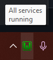
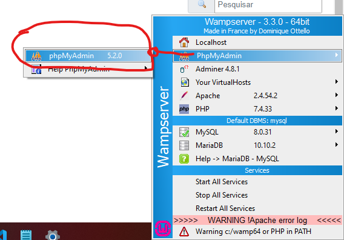
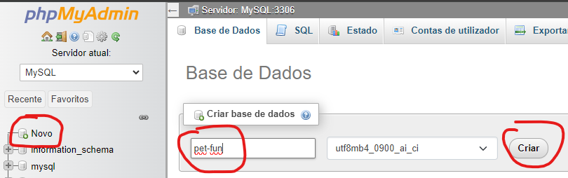
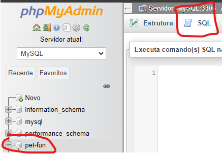

# PROJETO INTEGRADOR - ANÁLISE DE SOLUÇÕES INTEGRADAS PARA ORGANIZAÇÕES

## README: Projeto Integrador - 5º Semestre
Este repositório contém o código e a documentação para a 2ª entrega do Projeto Integrador - 5º Semestre

## Sobre o Projeto
Este projeto é parte do curso e representa uma aplicação prática do conteúdo desenvolvido durante a primeira entrega. Neste, desenvolvemos uma empresa prestadora de serviços de hospedagem de animais de estimação, denominada Pet Fun. Ao entrar no site, é solicitado o login e senha do usuário cadasrado. Caso não possua cadastro, há duas opções possíveis, cadastrar como interessado nos serviços (usuário), ou então como fornecedor da hospedagem.

## Como Usar (Utilizando wampserver)
Primeiro efetuar o download do wampserver e instalar: https://www.wampserver.com/en/#download-wrapper;
Criar uma pasta na área de trabalho e clonar o repositório com os arquivos fontes;
Após a instalação do Wamp e clone do projeto, copiar a pasta *SistemPet*, e colar na pasta www na raiz do WampServer(padrão C:\wamp64\www)
Após esse passo, executar o wampserver até que apareça dessa forma na barra de tarefas: ;
Clicar no icone do wampserver e ir até a opção PhpMyAdmin ;
Ao acessar o menu PhpMyAdmin preencher o utilizador como root, sem senha e apertar em *Entrada*
Logado no PhpMyAdmin, criar o scheema com nome de pet-fun: ;
Com a base criada, vamos criar as tabelas para os casos. Copiar os Scripts na pasta Banco de Dados: ;
Por fim, pode acessar o projeto em: http://localhost/SystemPet/index.php

1 - Caso cadastrado:  
1.1 - Digite o usuário e senha.  
1.2 - Clique em logar  
1.3 - Caso não lembre a senha, clique em "recuperar senha"  
1.4 - Caso deseje armazenar as senhas para acessos futuros, clique no campo "lembrar senha"  

2 - Caso tenha interesse em realizar o cadastro para ser usuário dos serviços:  
2.1 - Clique no botão "cadastrar" da tela inicial  
2.2 - Após ser direcionado a uma nova tela, preencha os campos solicitados.  
2.3 - Após preencher os campos indicados e concordar com os Termos e condições de uso e Política de privacidade, clicando em "Enviar Cadastro", o sistema processará os dados do usuário, disponibilizando o acesso através do login e senha digitados.  

3 - Caso tenha interesse em realizar o cadastro para hospedar animais de estimação:  
3.1 - Clique na opção "Quero ser host" da tela inicial  
3.2 - Após ser direcionado a uma nova tela, preencha os campos solicitados.  
3.3 - Após preencher os campos indicados e concordar com os Termos e condições de uso e Política de privacidade, clicando em "Enviar Cadastro", o sistema processará os dados do anfitrião (host), disponibilizando o acesso através do login e senha digitados.

4 - Caso buscar hóspede:  
4.1 - Digite o usuário e senha.  
4.2 - Clique em logar  
4.3 - Após realizar o login, clique em "Buscar Hóspede"  
4.4 - Aplique os filtros que desejar, em seguida clique em "Buscar"

## Tecnologias Utilizadas
HTML  
CSS  
JavaScript  
PHP

## Autores:
Aline Cardoso da Silva  
Danilo Ribeiro da Silva  
Gabriel de Sousa  
Wagner Dias de Souza
